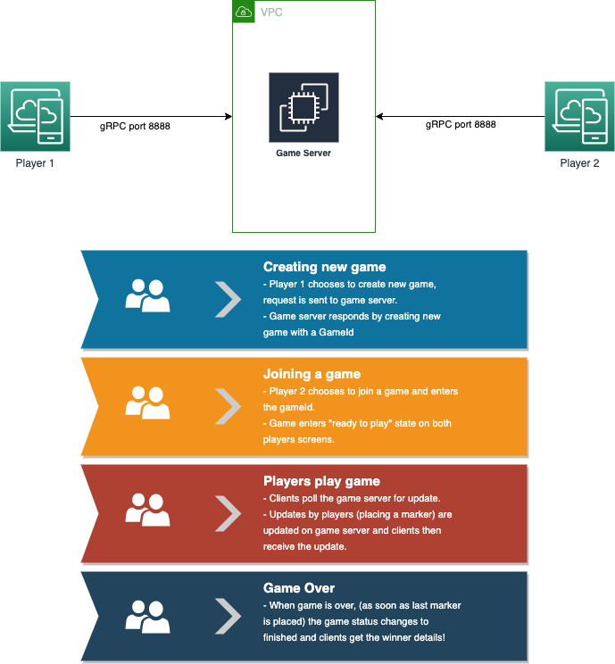
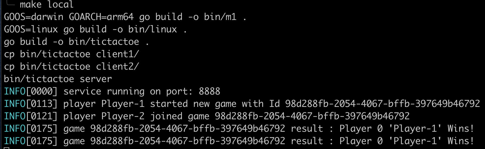
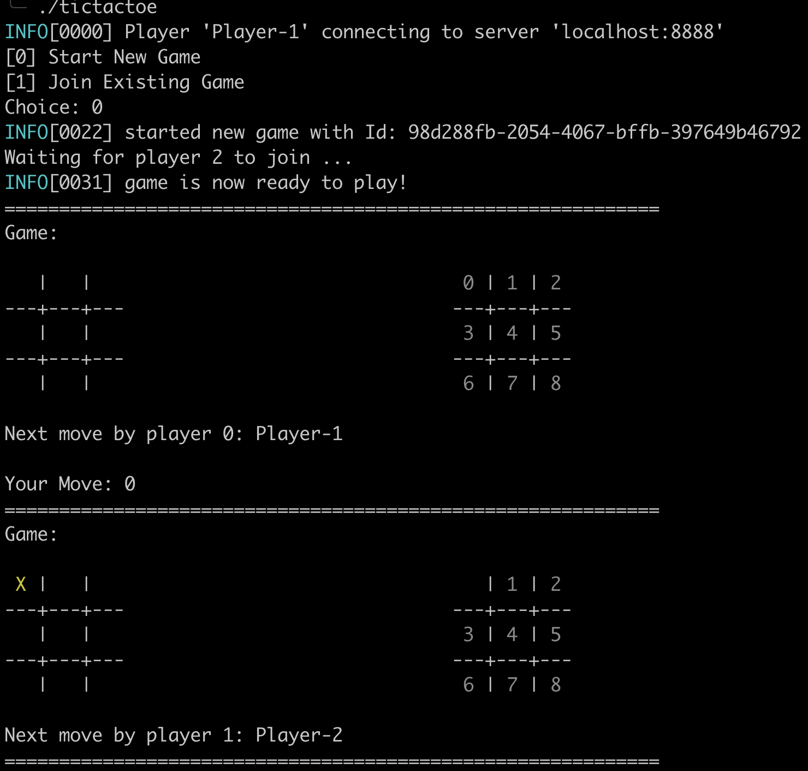
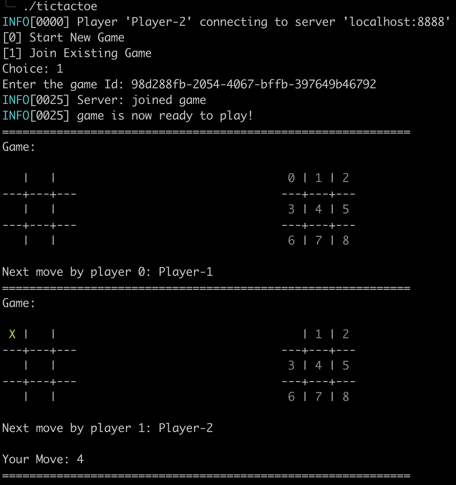
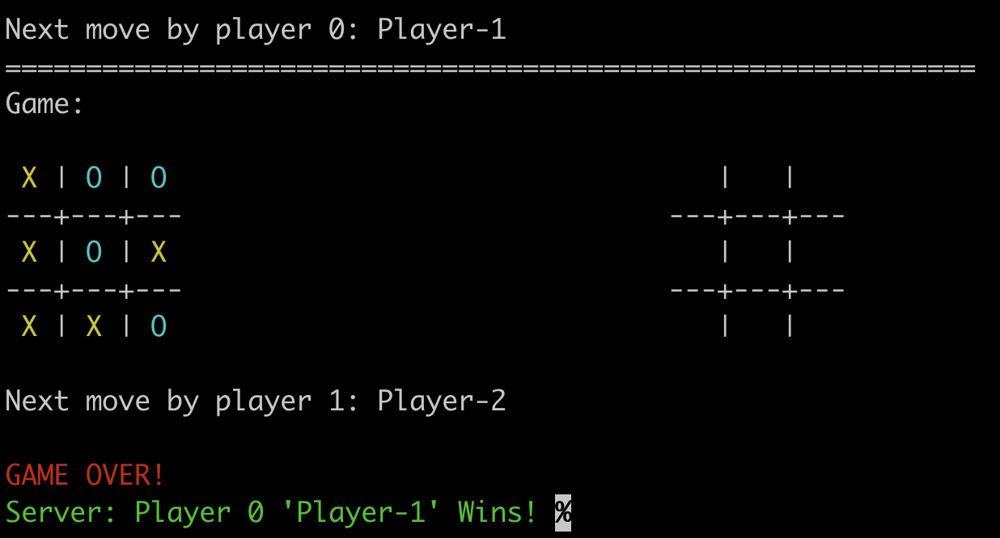

# Tic Tac Toe

a simple project to try to build a 2 player "tic-tac-toe" game :) 

## Why ?
- just for fun... 
- to be able to play a game of tic-tac-toe with my friends remotely

## Architecture 
- game server is responsible for coordinating the game and is the source of truth
- clients connect to game server to play game remotely 




## Server 
```
make cli 
./bin/tictactoe server
```


## Clients

- Player 1
```
bin/tictactoe 
```


- Player 2
```
bin/tictactoe 
```


- When game is over




